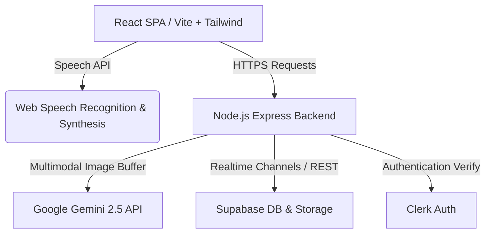

# Technical Architecture - Bharat Sewa AI

This document details the software architecture, backend API engines, and technical differentiator patterns of Bharat Sewa AI.

---

## 🛠️ Technology Stack



### Frontend Core
* **Framework:** React 19 + Vite 8
* **Styling:** Tailwind CSS (v4) with CSS Custom Theme variables mapped to Google Stitch design systems.
* **State & Query Management:** `zustand` (UI state) and `@tanstack/react-query` (data cache management).
* **Icons:** `lucide-react` for clean, lightweight visuals.

### Backend Core
* **Framework:** Node.js + Express
* **Database & File Storage:** Supabase (PostgreSQL client)
* **Auth System:** Clerk Auth (JWT verification middleware)

---

## 🧠 Core AI Components & Differentiators

### 1. Multimodal Gemini OCR (`visionService.js`)
Instead of utilizing standard Tesseract regex matchers (which fail on crumpled or rotated camera snapshots), the backend converts uploaded file buffers directly to base64 and invokes `gemini-2.5-flash` with a structured extraction prompt:

```javascript
const response = await ai.models.generateContent({
  model: 'gemini-2.5-flash',
  contents: [
    'Analyze this document. Extract key values in JSON format. For Aadhaar, retrieve name, date of birth, gender, and Aadhaar number.',
    filePart
  ],
});
```
This enables zero-configuration semantic parsing of document names, birthdays, addresses, and family members even under poor lighting conditions.

### 2. Conversational Intent & Routing (`aiService.js`)
Conversational inputs from the voice microphone are analyzed on-the-fly. The backend AI service injects system instructions contextually based on the user's portal page, dynamically routing queries to scheme matching database lookups or civic complaint categories.

### 3. Web Speech Hook (`useSpeech.js`)
Enables cross-browser accessibility using the native Web Speech API:
* **Speech-to-Text:** Uses `webkitSpeechRecognition` with auto-stop on silence.
* **Text-to-Speech:** Uses `SpeechSynthesisUtterance` to read responses aloud in Indian-accented English, Hindi, or Marathi dialects.

### 4. Local Offline Sync Storage
* Compliant forms (like broken streetlights or potholes) capture EXIF GPS coordinate metadata on photo uploads.
* If `navigator.onLine` returns false, coordinates, details, and image blobs are saved to `localStorage` in an offline sync queue.
* The frontend monitors connection status and flushes the queue to the backend once the socket/internet connects.
