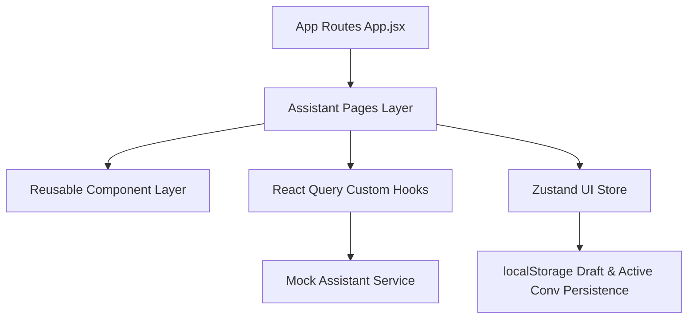

# Phase 4: AI & Voice Interaction Architecture

## Overview
Bharat Sewa AI Phase 4 provides a voice-first, multilingual citizen assistant frontend. All AI interactions, speech synthesis/recognition simulation, and query recommendations are decoupled via a clean mock service layer and state management boundary.

## Core Architectural Layers

### 1. State Division Strategy
- **Server Data (React Query - `useAssistantQuery.js`)**:
  - Encapsulates asynchronous query execution for active conversation history, list of historical threads, and mutations (`sendMessage`, `deleteConversation`, `pinConversation`, `renameConversation`).
  - Manages stale-time caching, retry strategies, and automatic query invalidation.
- **Client UI State (Zustand - `assistantUiStore.js`)**:
  - Tracks client-only state variables: draft text input, listening status, real-time audio wave energy values, active category filters, and search query inputs.
  - Automatically mirrors unsaved input drafts into `localStorage`.

### 2. Route Topology
All 7 states operate under explicit React Router paths:
- `/assistant` — Home view with prompt shortcuts
- `/assistant/listening` — Voice visualizer state
- `/assistant/transcript` — Intent verification card
- `/assistant/thinking` — Processing step checklist
- `/assistant/chat` — Interactive conversation thread with scheme recommendations
- `/assistant/history` — Searchable archived chat list
- `/assistant/error` — Fallback nap state

### 3. Accessibility & Motion Guidelines
- **Motion Reduction**: All animated components (`VoiceMicButton`, `WaveformVisualizer`, `TypingIndicator`) implement Tailwind `motion-reduce:*` variants to respect user OS accessibility preferences.
- **Screen Reader Announcements**: Key state updates employ `aria-live="polite"` regions for dynamic content changes.
