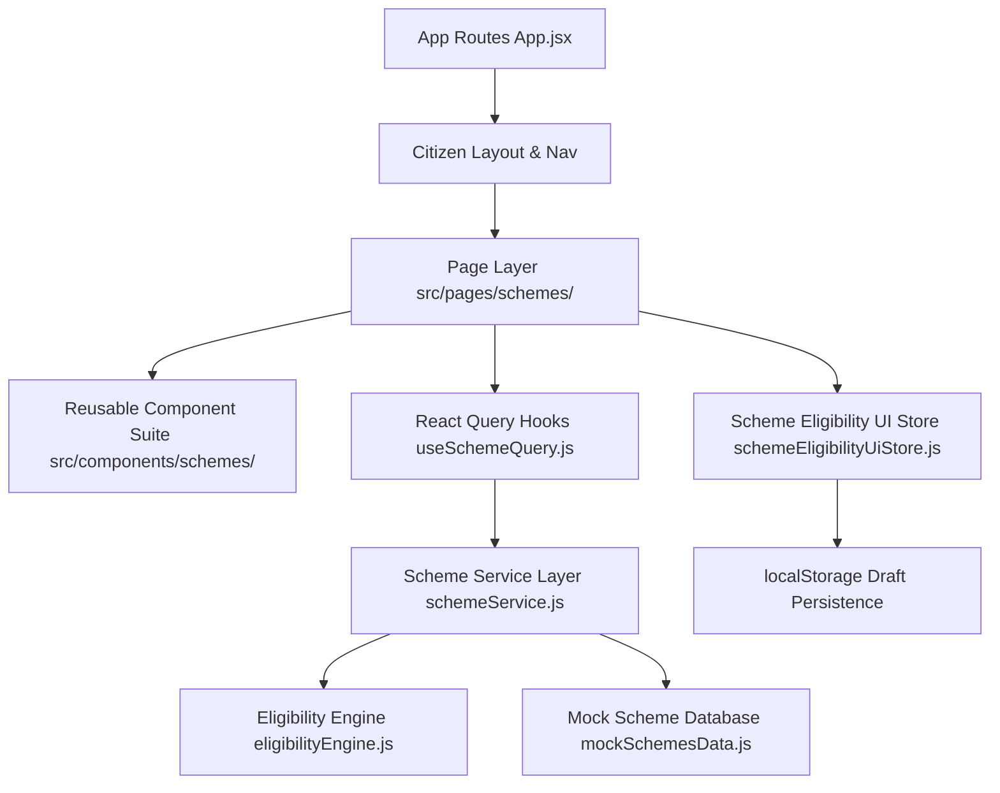

# Phase 5: Scheme Architecture Documentation

## Overview
Phase 5 implements the complete citizen-facing Government Scheme Discovery and Eligibility Checker module for **Bharat Sewa AI**.

## Architecture & Layering

## State Management Rules
1. **Server-style Data (React Query - `useSchemeQuery.js`)**:
   - Manages scheme listing, search results, recommended schemes, saved scheme bookmarks, detailed views, required documents, eligibility questions, and evaluation result fetching.
2. **Client Flow State (Zustand - `schemeEligibilityUiStore.js`)**:
   - Manages active scheme eligibility check session, current question step index, and per-scheme isolated draft answers persisted in `localStorage`.
3. **Filter & Search Preservation**:
   - Search parameters (`q`, `category`, `sort`) are managed via URL search parameters (`useSearchParams`), ensuring filters remain preserved when navigating to scheme details and back.

## Route Mapping
- `/schemes` — Scheme Discovery Page
- `/schemes/recommended` — Recommended Schemes Page
- `/schemes/saved` — Saved Schemes Page
- `/schemes/:schemeId` — Scheme Details Page
- `/schemes/:schemeId/eligibility` — Eligibility Intro Page
- `/schemes/:schemeId/eligibility/questions` — Questionnaire Step View
- `/schemes/:schemeId/eligibility/result` — Eligibility Result View
- `/schemes/:schemeId/documents` — Required Documents View
- `/schemes/:schemeId/apply` — Application Handoff Page (Phase 6 Placeholder)
