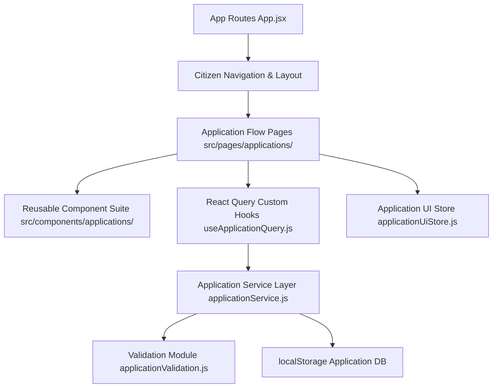

# Phase 6: Application Workflow & Submission Architecture

## Overview
Phase 6 establishes a full citizen-facing government scheme application workflow for **Bharat Sewa AI**.

## System Topology & Layers

## State Management Principles
1. **Server Data (React Query - `useApplicationQuery.js`)**:
   - Handles async application record retrieval, list queries, section updates, document attachments, validation queries, and submission mutations.
2. **Client UI State (Zustand - `applicationUiStore.js`)**:
   - Tracks active step indices, active section IDs, modal dialog states (`isSaveAndExitDialogOpen`, `isSubmitDialogOpen`), and unsaved draft flags.
3. **Draft Persistence (`applicationService.js`)**:
   - Persists application drafts to `localStorage` (`bharat_sewa_applications_v1`).
   - Prevents duplicate draft creation per citizen and scheme.
