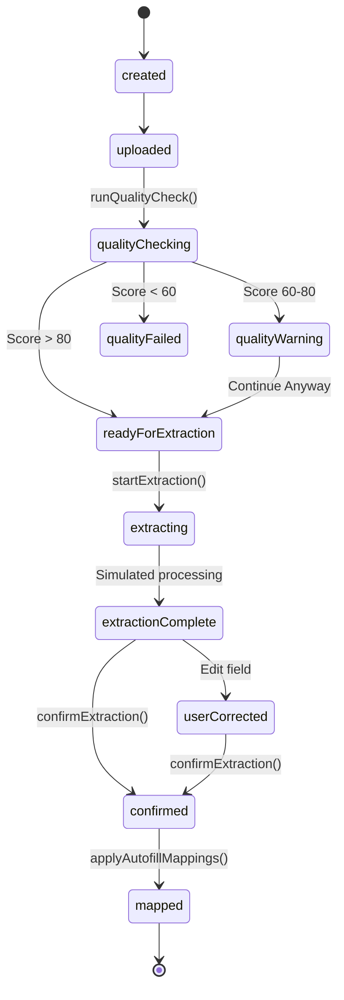

# Phase 7: OCR Architecture & State Machine Specifications

## Overview
Phase 7 implements a safe, citizen-facing mock OCR document scanning and application autofill module for **Bharat Sewa AI**.

## System Topology & State Machine

## Service Layer & Persistence
1. **`ocrService.js`**: Controls document session states, confidence levels (94%, 78%, 52%), sensitive identifier masking (`XXXX-XXXX-4821`), and Digital Locker synchronization with label `User-reviewed extraction`.
2. **`documentQualityService.js`**: Analyzes blur, lighting exposure, edge crop boundaries, and resolution (good, warning, poor).
3. **`documentMappingService.js`**: Detects mapping conflicts (`different-value`, `low-confidence`) and applies selected transformations (`currencyNumber`, `number`, `maskedString`, `uppercase`, `trim`).
